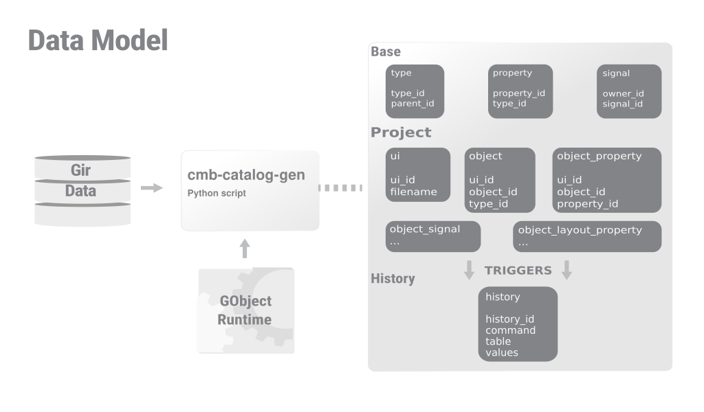
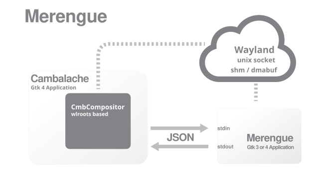

Cambalache is a new RAD tool for Gtk 4 and 3 with a clear MVC design and data model first philosophy.
This translates to a wide feature coverage with minimal/none developer intervention for basic support.



To support multiple Gtk versions it renders the workspace out of process using
a custom wayland compositor widget based on wlroots.



## License

Cambalache is distributed under the [GNU Lesser General Public License](https://www.gnu.org/licenses/old-licenses/lgpl-2.1.en.html),
version 2.1 (LGPL) as described in the COPYING file.

Tools are distributed under the [GNU General Public License](https://www.gnu.org/licenses/gpl-2.0.en.html),
version 2 (GPL) as described in the COPYING.GPL file.

## Source code

Source code lives on GNOME gitlab [here](https://gitlab.gnome.org/jpu/cambalache)

`git clone https://gitlab.gnome.org/jpu/cambalache.git`

## Dependencies

* Python 3 - Cambalache is written in Python
* [Meson](http://mesonbuild.com) build system
* [GTK](http://www.gtk.org) 3 and 4
* python-gi - Python GTK bindings
* python3-lxml - Python libxml2 bindings
* [casilda](https://gitlab.gnome.org/jpu/casilda) - Workspace custom compositor

## Flathub

Flathub is the place to get and distribute apps for all of desktop Linux.
It is powered by Flatpak, allowing Flathub apps to run on almost any Linux 
distribution.

Instructions on how to install flatpak can be found [here](https://flatpak.org/setup/).

You can get the official build [here](https://flathub.org/apps/details/ar.xjuan.Cambalache)

Use the following to install:
```
flatpak remote-add --user --if-not-exists flathub https://flathub.org/repo/flathub.flatpakrepo
flatpak install --user flathub ar.xjuan.Cambalache
```

## Flatpak

Use the following commands to install build dependencies:

```
flatpak remote-add --user --if-not-exists gnome-nightly https://nightly.gnome.org/gnome-nightly.flatpakrepo
flatpak install --user org.gnome.Sdk//master
flatpak install --user org.gnome.Platform//master
```

Build your bundle with the following commands

```
flatpak-builder --force-clean --repo=repo build ar.xjuan.Cambalache.json
flatpak build-bundle repo cambalache.flatpak ar.xjuan.Cambalache
flatpak install --user cambalache.flatpak
```
Or if you have `make` installed in your host

```
make install
```

Will create the flatpak repository, then the bundle and install it

Run as:
```
flatpak run --user ar.xjuan.Cambalache//master
```

## Manual installation

This is a regular meson package and can be installed the usual way.

```
# Configure project in _build directory
meson setup --wipe --prefix=~/.local _build .

# Build and install in ~/.local
ninja -C _build install
```

To run it from .local/ you might need to setup a few env variable depending on your distribution

```
export PYTHONPATH=~/.local/lib/python3/dist-packages/
export LD_LIBRARY_PATH=~/.local/lib/x86_64-linux-gnu/
export GI_TYPELIB_PATH=~/.local/lib/x86_64-linux-gnu/girepository-1.0/
cambalache
```

## Docker

While docker is not meant for UI applications it is possible to build an image
with Cambalache and run it.

Build the image with:
```
docker build -t cambalache .
```

On linux, enable localhost connections to your X server and run with:
```
xhost +local:
docker run -v /tmp/.X11-unix:/tmp/.X11-unix cambalache
```

NOTE: There is no official support for Docker, please use Flatpak if possible.

## MS Windows

Instructions to run in MS Windows are [here](README.win.md)

NOTE: There is no official support for Windows yet, these instruction should be
taken with a grain of salt as they might not work on all Windows versions or
be obsolete.

## MacOS

Instructions to run in MacOS are [here](README.mac.md)

NOTE: There is no official support for MacOS yet, these instruction should be
taken with a grain of salt as they might not work on all MacOS versions or
be obsolete.

## Running from sources

To run it without installing use run-dev.py script, it will automatically compile
resources and create extra files needed to run assuming you have everything
needed installed locally. (Follow manual installation to ensure you have
everything needed)

`./run-dev.py`

This is meant for Cambalache development only.

## Contributing

If you are interested in contributing you can open an issue [here](https://gitlab.gnome.org/jpu/cambalache/-/issues)
and/or a merge request [here](https://gitlab.gnome.org/jpu/cambalache/-/merge_requests)

## Contact

You can hang with us and ask us questions on Matrix at #cambalache:gnome.org

[Matrix](https://matrix.to/#/#cambalache:gnome.org)

## Financial support

You can financially support Cambalache development on Liberapay or Patreon
like all these [people](./SUPPORTERS.md) did.

[Liberapay](https://liberapay.com/xjuan)
 - Liberapay is a recurrent donations platform
 - Run by a non-profit organization
 - Source code is public
 - No commission fee
 - ~5% payment processing fee

[Patreon](https://www.patreon.com/cambalache)
 - Patreon is a membership platform for creators
 - Run by private company
 - No source code available
 - ~8% commission fee
 - ~8% payment processing fee

## Tools

 - cambalache-db:
   Generate Data Model from Gir files

 - db-codegen:
   Generate GObject classes from DB tables
